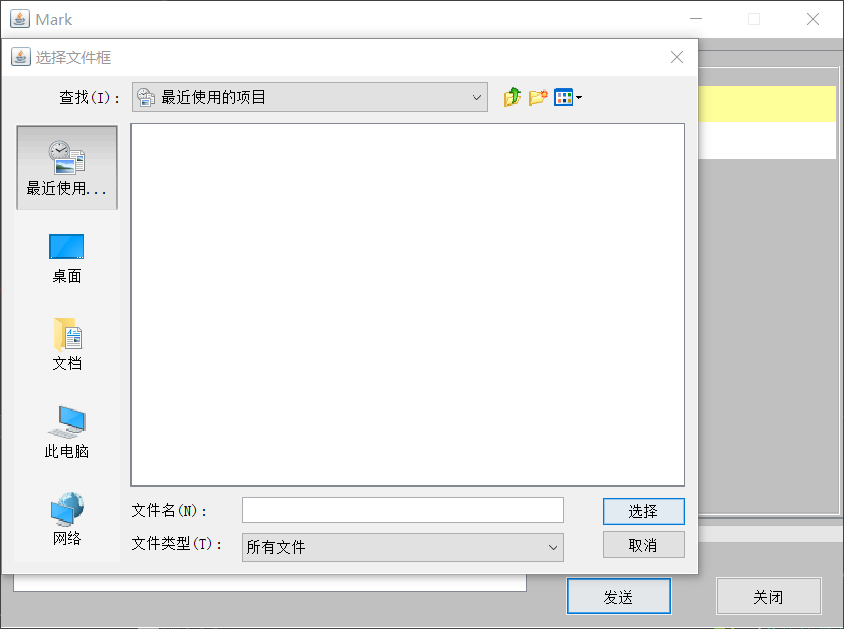

# 基于Socket的网络聊天室

Created on 2020-4-20 
Author:<1252665997@qq.com> 
Version 1.0 

## 环境依赖
>JDK1.8

## 部署步骤
>1.将该项目导入IDEA（注意：该项目的编码格式为GBK）  
>2.先运行server包下的MyServer.java，启动服务器  
>3.然后运行login包下的MyLogin.java，启动客户端，支持多用户聊天

## 项目结构
+ N422chat  
   + bean           将传输所需的全部数据封装在以下的两个实体类中
     + ClientBean
     + PacketBean
   + client
     + MyChatroom   聊天界面 
   + login
     + MyLogin      登录界面 
     + MyRegister   注册界面 
   + server
     + MyServer     服务器端程序 
   + util
     + MyUtil       封装了对文件加载，获取当前时间的操作 
+ Users.properties  存放用户名和密码

## V1.0版本内容
>登录界面 
.
<!-- -->
> 注册账号 
.
<!-- -->
> 聊天 
.
<!-- -->
> 传输文件 
.
<!-- -->
